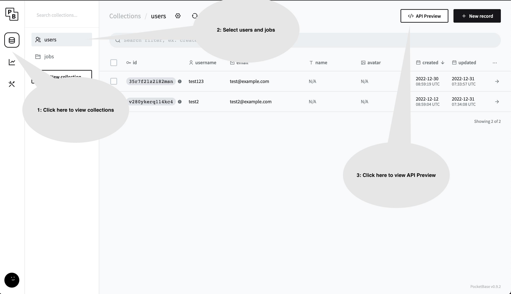
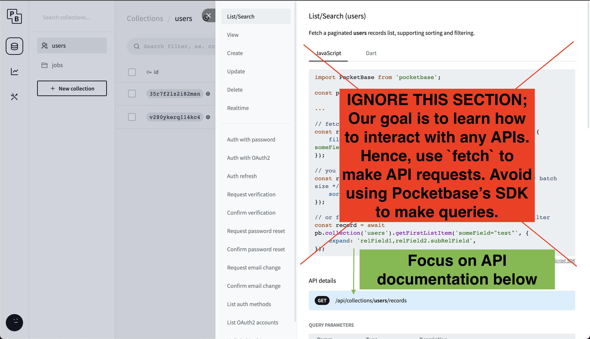

# NEXT Jobs Backend

This repository is used for NEXT Academy's Full-Stack Coding Bootcamp, specifically to learn frontend web development.

This repository is merely the backend of NEXT Jobs. We utilize Pocketbase instead of building our own backend application.

## Run it Locally
1. Install Docker Engine and Docker Compose on your machine.
    1. Mac: https://docs.docker.com/get-docker/
    2. Windows: https://docs.docker.com/desktop/windows/wsl/
2. Clone this repository 
    ````sh
    git clone git@github.com:NextAcademy/next-jobs-db-backend.git # if you have already set up SSH keys
    git clone https://github.com/NextAcademy/next-jobs-db-backend.git
    ```
4. Navigate into the root of this repository `cd </path/to/project>`
5. Run! `docker-compose up -d` or `docker compose up -d` depending on your version of Docker Compose
6. Go to `http://localhost:8080/_/` in your browser
7. Log in with following credentials:
```
email: next@example.com
password: Zc7UfnTGUTw
```

## Viewing API Documentation


